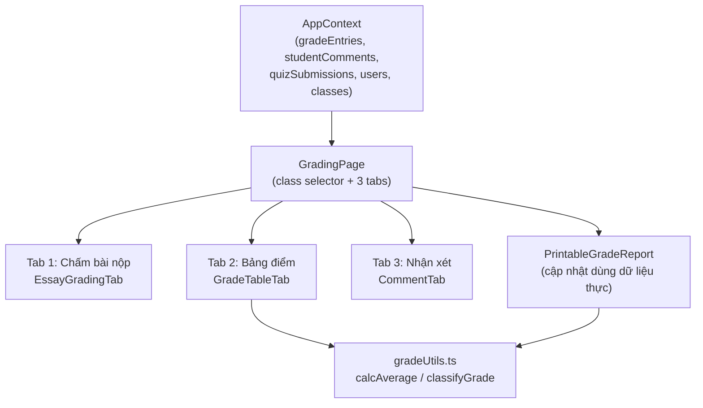

# Tài liệu Thiết kế: Chấm điểm và Nhận xét

## Tổng quan

Tính năng **Chấm điểm và Nhận xét** nâng cấp `GradingPage.tsx` từ một trang chỉ đọc với dữ liệu tĩnh thành một hệ thống chấm điểm đầy đủ chức năng. Toàn bộ dữ liệu được lưu trong `AppContext` (in-memory + localStorage), không có backend. Giao diện sử dụng React 19, TypeScript, Tailwind CSS 4, và Framer Motion theo đúng phong cách hiện có của dự án.

Kiến trúc tổng thể:
- **AppContext** mở rộng thêm `gradeEntries`, `studentComments` và 5 action mới.
- **GradingPage** được tái cấu trúc thành 3 tab, kết nối hoàn toàn với AppContext.
- **Các component con** được tách ra để dễ bảo trì và kiểm thử.
- **gradeUtils.ts** đã có sẵn `calcAverage` và `classifyGrade` — tái sử dụng trực tiếp.

---

## Kiến trúc



Luồng dữ liệu:
1. `GradingPage` đọc `classes`, `users`, `gradeEntries`, `studentComments`, `quizSubmissions` từ AppContext.
2. Người dùng chọn lớp → tất cả tab lọc theo `classId`.
3. Mỗi tab gọi action tương ứng (`gradeEssaySubmission`, `addGradeEntry`, `updateGradeEntry`, `deleteGradeEntry`, `saveStudentComment`).
4. AppContext cập nhật state → React re-render tự động.

---

## Các thành phần và giao diện

### 1. Mở rộng AppContext (`src/context/AppContext.tsx`)

**Thêm vào `AppContextType`:**

```typescript
// State mới
gradeEntries: GradeEntry[];
studentComments: StudentComment[];

// Actions mới
addGradeEntry: (entry: Omit<GradeEntry, 'id'>) => void;
updateGradeEntry: (id: string, data: Partial<GradeEntry>) => void;
deleteGradeEntry: (id: string) => void;
saveStudentComment: (comment: Omit<StudentComment, 'id' | 'createdAt' | 'updatedAt'>) => void;
gradeEssaySubmission: (submissionId: string, score: number, comment?: string) => void;
```

**Triển khai `saveStudentComment`:**
```typescript
// Upsert: tìm theo (studentId, classId) — nếu có thì update, không thì tạo mới
const existing = studentComments.find(
  c => c.studentId === comment.studentId && c.classId === comment.classId
);
if (existing) {
  setStudentComments(prev => prev.map(c =>
    c.id === existing.id
      ? { ...c, content: comment.content, updatedAt: new Date().toISOString() }
      : c
  ));
} else {
  setStudentComments(prev => [...prev, {
    ...comment,
    id: `CMT-${Date.now()}`,
    createdAt: new Date().toISOString(),
    updatedAt: new Date().toISOString(),
  }]);
}
```

**Triển khai `gradeEssaySubmission`:**
```typescript
// Cập nhật score trong quizSubmissions
setQuizSubmissions(prev => prev.map(s =>
  s.id === submissionId ? { ...s, score } : s
));
// Nếu có comment, lưu nhận xét
if (comment) {
  const submission = quizSubmissions.find(s => s.id === submissionId);
  if (submission) {
    saveStudentComment({
      studentId: submission.studentId,
      classId: /* lấy từ assignment */,
      teacherId: currentAccount!.id,
      content: comment,
    });
  }
}
```

### 2. GradingPage (`src/pages/GradingPage.tsx`)

Cấu trúc mới:

```typescript
export default function GradingPage() {
  const { classes, users, gradeEntries, studentComments, quizSubmissions,
          canAccess, currentAccount, CLASS_STUDENT_MAP } = useAppContext();

  const [selectedClassId, setSelectedClassId] = useState<string>('');
  const [activeTab, setActiveTab] = useState<'essay' | 'grades' | 'comments'>('grades');

  // Phân quyền
  const canGrade = canAccess('grade_assignments');
  const canViewOwn = canAccess('view_own_grades');
  const canExport = canAccess('export_grades');

  // Lọc học viên theo lớp và vai trò
  const studentIds = CLASS_STUDENT_MAP[selectedClassId] ?? [];
  // ... lọc thêm theo role (student chỉ thấy mình, parent thấy con)

  return (
    <>
      {/* Class selector dropdown */}
      {/* Tab navigation */}
      {/* Tab content */}
    </>
  );
}
```

### 3. EssayGradingTab (`src/components/grading/EssayGradingTab.tsx`)

Props:
```typescript
interface EssayGradingTabProps {
  classId: string;
  submissions: QuizSubmission[];   // đã lọc: essay + chưa có score
  assignments: Assignment[];
  users: User[];
  onGrade: (submissionId: string, score: number, comment?: string) => void;
}
```

Mỗi bài nộp hiển thị:
- Tên học viên + tên bài tập + thời gian nộp
- Nội dung câu trả lời tự luận (có thể thu gọn/mở rộng)
- Input điểm (0–10, step 0.5) + textarea nhận xét tùy chọn
- Nút "Lưu điểm" — disabled khi input không hợp lệ

Validation:
```typescript
const isValidScore = (v: string) => {
  const n = parseFloat(v);
  return !isNaN(n) && n >= 0 && n <= 10;
};
```

### 4. GradeTableTab (`src/components/grading/GradeTableTab.tsx`)

Props:
```typescript
interface GradeTableTabProps {
  classId: string;
  students: User[];
  gradeEntries: GradeEntry[];
  readOnly: boolean;
  onAdd: (entry: Omit<GradeEntry, 'id'>) => void;
  onUpdate: (id: string, data: Partial<GradeEntry>) => void;
  onDelete: (id: string) => void;
}
```

Cấu trúc bảng:
- Mỗi hàng = một học viên
- Mỗi cột loại điểm = nhóm các `GradeEntry` có `scoreType` tương ứng
- Ô điểm: click để chỉnh sửa inline (chỉ khi `!readOnly`)
- Hàng cuối: Điểm TB (tính từ `calcAverage`) + Xếp loại (từ `classifyGrade`)

Inline editing:
```typescript
// State local cho ô đang chỉnh sửa
const [editingCell, setEditingCell] = useState<{
  studentId: string;
  scoreType: ScoreType;
  entryId?: string;
} | null>(null);
```

### 5. CommentTab (`src/components/grading/CommentTab.tsx`)

Props:
```typescript
interface CommentTabProps {
  classId: string;
  students: User[];
  comments: StudentComment[];
  readOnly: boolean;
  teacherId: string;
  onSave: (comment: Omit<StudentComment, 'id' | 'createdAt' | 'updatedAt'>) => void;
}
```

Mỗi học viên:
- Avatar + tên
- Textarea (max 1000 ký tự) với bộ đếm ký tự
- Hiển thị `updatedAt` nếu đã có nhận xét
- Nút "Lưu nhận xét" (disabled khi nội dung rỗng/chỉ khoảng trắng)

---

## Mô hình dữ liệu

### GradeEntry

```typescript
export interface GradeEntry {
  id: string;                    // "GE-{timestamp}"
  studentId: string;             // tham chiếu User.id
  classId: string;               // tham chiếu Class.id
  assignmentId?: string;         // tham chiếu Assignment.id (tùy chọn)
  title: string;                 // "Kiểm tra miệng", "15 phút", v.v.
  scoreType: ScoreType;
  score: number;                 // 0–10
  maxScore: number;              // mặc định 10
  gradedBy: string;              // teacherId
  gradedAt: string;              // ISO date
}

export type ScoreType =
  | 'oral'        // Kiểm tra miệng
  | 'quiz_15'     // 15 phút
  | 'quiz_45'     // 1 tiết
  | 'midterm'     // Giữa kỳ
  | 'final'       // Cuối kỳ
  | 'homework'    // BTVN
  | 'assignment'; // Bài tập liên kết
```

### StudentComment

```typescript
export interface StudentComment {
  id: string;          // "CMT-{timestamp}"
  studentId: string;   // tham chiếu User.id
  classId: string;     // tham chiếu Class.id
  teacherId: string;   // tham chiếu User.id (giáo viên)
  content: string;     // tối đa 1000 ký tự
  createdAt: string;   // ISO date
  updatedAt: string;   // ISO date
}
```

### Dữ liệu mẫu khởi tạo (`initialGradeEntries`)

```typescript
const initialGradeEntries: GradeEntry[] = [
  // Lớp MATH-06-01
  { id: 'GE-001', studentId: 'ST-2023-084', classId: 'MATH-06-01',
    title: 'Kiểm tra miệng', scoreType: 'oral', score: 8, maxScore: 10,
    gradedBy: 'TCH-109', gradedAt: '2025-03-01T08:00:00.000Z' },
  { id: 'GE-002', studentId: 'ST-2023-201', classId: 'MATH-06-01',
    title: '15 phút - Chương 2', scoreType: 'quiz_15', score: 7.5, maxScore: 10,
    gradedBy: 'TCH-109', gradedAt: '2025-03-05T08:00:00.000Z' },
  // ... thêm dữ liệu mẫu cho các học viên khác
];
```

### Quan hệ dữ liệu

```
Class (1) ──── (*) GradeEntry
Class (1) ──── (*) StudentComment
User/Student (1) ──── (*) GradeEntry
User/Student (1) ──── (0..1) StudentComment [per class]
Assignment (1) ──── (*) QuizSubmission
QuizSubmission (1) ──── (0..1) score [essay: manual, MC: auto]
```

---

## Thuộc tính đúng đắn (Correctness Properties)

*Một thuộc tính là đặc điểm hoặc hành vi phải đúng trong mọi lần thực thi hợp lệ của hệ thống — về cơ bản là một phát biểu hình thức về những gì hệ thống phải làm. Các thuộc tính là cầu nối giữa đặc tả dạng văn bản và đảm bảo đúng đắn có thể kiểm chứng tự động.*

### Property 1: Điểm trung bình phản ánh đúng tất cả GradeEntry

*Với mọi* tập hợp `GradeEntry` của một học viên trong một lớp, điểm trung bình hiển thị phải bằng `calcAverage(entries.map(e => e.score))`.

**Validates: Yêu cầu 7.1, 7.4, 7.5**

### Property 2: Xếp loại nhất quán với điểm trung bình

*Với mọi* điểm trung bình `avg`, xếp loại hiển thị phải bằng `classifyGrade(avg)` — không có trường hợp ngoại lệ.

**Validates: Yêu cầu 7.3**

### Property 3: saveStudentComment là upsert — không tạo trùng

*Với mọi* cặp `(studentId, classId)`, sau khi gọi `saveStudentComment` bất kỳ số lần nào, `studentComments` chỉ chứa đúng một bản ghi cho cặp đó.

**Validates: Yêu cầu 1.8, 1.9**

### Property 4: Điểm hợp lệ nằm trong khoảng [0, 10]

*Với mọi* `GradeEntry` trong `gradeEntries`, `score` phải thỏa mãn `0 ≤ score ≤ maxScore ≤ 10`.

**Validates: Yêu cầu 4.5, 5.5**

### Property 5: gradeEssaySubmission cập nhật đúng submission

*Với mọi* `QuizSubmission` có `id = submissionId`, sau khi gọi `gradeEssaySubmission(submissionId, score)`, `quizSubmissions.find(s => s.id === submissionId).score` phải bằng `score`.

**Validates: Yêu cầu 1.10, 4.4**

### Property 6: Bài đã chấm không còn trong danh sách chờ

*Với mọi* `QuizSubmission` có `score !== undefined`, bài đó không được xuất hiện trong danh sách "chờ chấm" của Tab Chấm bài nộp.

**Validates: Yêu cầu 4.7**

### Property 7: Học viên/phụ huynh chỉ thấy dữ liệu của mình

*Với mọi* người dùng có vai trò `student`, tập hợp `studentId` trong dữ liệu hiển thị chỉ chứa `currentAccount.id`. *Với mọi* người dùng có vai trò `parent`, tập hợp `studentId` trong dữ liệu hiển thị chỉ là tập con của `PARENT_CHILD_MAP[currentAccount.id]`.

**Validates: Yêu cầu 2.2, 2.3**

### Property 8: Nhận xét không vượt quá 1000 ký tự

*Với mọi* `StudentComment` trong `studentComments`, `content.length ≤ 1000`.

**Validates: Yêu cầu 6.7**

---

## Xử lý lỗi

| Tình huống | Xử lý |
|---|---|
| Điểm nhập ngoài [0, 10] | Hiển thị lỗi inline, không gọi action, giữ nguyên state |
| Điểm không phải số hợp lệ | Hiển thị lỗi inline, không gọi action |
| Nhận xét rỗng/chỉ khoảng trắng | Disable nút lưu + hiển thị thông báo |
| Nhận xét vượt 1000 ký tự | Disable nút lưu + hiển thị bộ đếm màu đỏ |
| Không có lớp nào được chọn | Hiển thị trạng thái trống với hướng dẫn |
| Không có bài tự luận chờ chấm | Hiển thị thông báo "Không có bài chờ chấm" |
| Người dùng không có quyền | Hiển thị thông báo "Không có quyền truy cập" |

---

## Chiến lược kiểm thử

### Kiểm thử đơn vị (Unit Tests)

Tập trung vào các hàm thuần túy và logic nghiệp vụ:

- `calcAverage([])` → `null`
- `calcAverage([8, 9, 10])` → `9.0`
- `classifyGrade(9.0)` → `'Xuất sắc'`
- `classifyGrade(null)` → `'Chưa có điểm'`
- Validation điểm: `isValidScore('11')` → `false`, `isValidScore('abc')` → `false`
- Validation nhận xét: `isValidComment('   ')` → `false`

### Kiểm thử thuộc tính (Property-Based Tests)

Sử dụng thư viện **fast-check** (TypeScript). Mỗi property test chạy tối thiểu **100 lần** với dữ liệu ngẫu nhiên.

**Cấu hình tag:**
```
Feature: grading-and-feedback, Property {N}: {mô tả ngắn}
```

**Property 1 — Điểm TB phản ánh đúng GradeEntry:**
```typescript
// Feature: grading-and-feedback, Property 1: average reflects all grade entries
fc.assert(fc.property(
  fc.array(fc.float({ min: 0, max: 10 }), { minLength: 1 }),
  (scores) => {
    const entries = scores.map((s, i) => makeGradeEntry(s, i));
    const displayed = computeDisplayedAverage(entries);
    return displayed === calcAverage(scores);
  }
), { numRuns: 100 });
```

**Property 2 — Xếp loại nhất quán:**
```typescript
// Feature: grading-and-feedback, Property 2: classification consistent with average
fc.assert(fc.property(
  fc.float({ min: 0, max: 10 }),
  (avg) => classifyGrade(avg) === expectedClassification(avg)
), { numRuns: 100 });
```

**Property 3 — saveStudentComment là upsert:**
```typescript
// Feature: grading-and-feedback, Property 3: saveStudentComment is upsert
fc.assert(fc.property(
  fc.string(), fc.string(), fc.array(fc.string(), { minLength: 1, maxLength: 5 }),
  (studentId, classId, contents) => {
    let comments: StudentComment[] = [];
    for (const content of contents) {
      comments = applyUpsert(comments, { studentId, classId, content });
    }
    return comments.filter(c => c.studentId === studentId && c.classId === classId).length === 1;
  }
), { numRuns: 100 });
```

**Property 4 — Điểm hợp lệ trong [0, 10]:**
```typescript
// Feature: grading-and-feedback, Property 4: scores are within valid range
fc.assert(fc.property(
  fc.float({ min: 0, max: 10 }),
  (score) => {
    const entry = addGradeEntryToState(score);
    return entry.score >= 0 && entry.score <= entry.maxScore && entry.maxScore <= 10;
  }
), { numRuns: 100 });
```

**Property 5 — gradeEssaySubmission cập nhật đúng:**
```typescript
// Feature: grading-and-feedback, Property 5: gradeEssaySubmission updates correct submission
fc.assert(fc.property(
  fc.float({ min: 0, max: 10 }),
  fc.array(fc.record({ id: fc.string(), score: fc.option(fc.float()) }), { minLength: 1 }),
  (newScore, submissions) => {
    const target = submissions[0];
    const result = applyGradeEssay(submissions, target.id, newScore);
    return result.find(s => s.id === target.id)?.score === newScore;
  }
), { numRuns: 100 });
```

**Property 6 — Bài đã chấm không trong danh sách chờ:**
```typescript
// Feature: grading-and-feedback, Property 6: graded submissions not in pending list
fc.assert(fc.property(
  fc.array(fc.record({ id: fc.string(), score: fc.option(fc.float({ min: 0, max: 10 })) })),
  (submissions) => {
    const pending = getPendingEssays(submissions);
    return pending.every(s => s.score === undefined);
  }
), { numRuns: 100 });
```

**Property 7 — Học viên chỉ thấy dữ liệu của mình:**
```typescript
// Feature: grading-and-feedback, Property 7: student sees only own data
fc.assert(fc.property(
  fc.string(), fc.array(fc.record({ studentId: fc.string(), score: fc.float() })),
  (myId, allEntries) => {
    const visible = filterForStudent(allEntries, myId);
    return visible.every(e => e.studentId === myId);
  }
), { numRuns: 100 });
```

**Property 8 — Nhận xét không vượt 1000 ký tự:**
```typescript
// Feature: grading-and-feedback, Property 8: comment content within 1000 chars
fc.assert(fc.property(
  fc.string({ maxLength: 1000 }),
  (content) => {
    const comment = saveComment(content);
    return comment.content.length <= 1000;
  }
), { numRuns: 100 });
```
