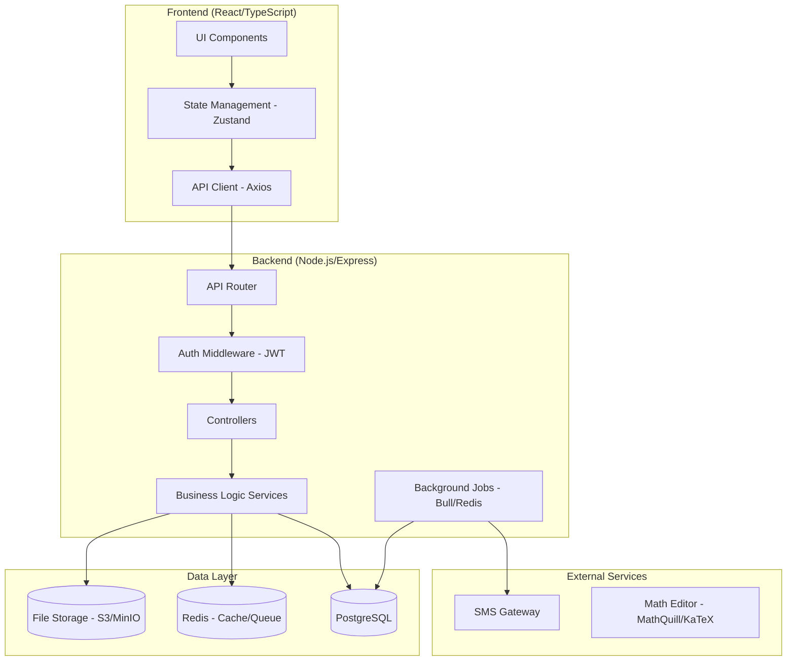

# Tài liệu Thiết kế: Cải tiến Hệ thống Quản lý Trung tâm Toán học

## Tổng quan

Tài liệu này mô tả kiến trúc kỹ thuật và thiết kế chi tiết cho các cải tiến hệ thống quản lý trung tâm toán học. Hệ thống được xây dựng theo kiến trúc monolith modular với frontend React/TypeScript và backend Node.js/Express, sử dụng PostgreSQL làm cơ sở dữ liệu chính.

Các cải tiến bao gồm 7 module: UI/UX Chung, Lớp học & Lịch học, Điểm danh, Bài tập & Kiểm tra, Tài liệu, Điểm số, Thông báo và Cổng thông tin Phụ huynh.

## Kiến trúc




## Các Component và Giao diện

### Module 0: UI/UX Chung

**ActionColumn Component**
```typescript
interface ActionColumnProps {
  actions: ('view' | 'edit' | 'delete' | 'note')[];
  onAction: (type: string, id: string) => void;
  itemId: string;
}
// Luôn hiển thị tất cả icon, không dùng CSS hover để ẩn/hiện
```

**StatusBadge Component**
```typescript
type AssignmentStatus = 'open' | 'pending_grade' | 'graded' | 'overdue';
type AssignmentType = 'essay' | 'multiple_choice';

const STATUS_COLORS: Record<AssignmentStatus, string> = {
  open: '#22c55e',        // xanh lá
  pending_grade: '#eab308', // vàng
  graded: '#3b82f6',      // xanh dương
  overdue: '#ef4444',     // đỏ
};

const TYPE_COLORS: Record<AssignmentType, string> = {
  essay: '#a855f7',         // tím
  multiple_choice: '#f97316', // cam
};
```

**PaginatedList Component**
- Tự động kích hoạt phân trang khi số bản ghi > 50
- Hỗ trợ cả Pagination và Infinite Scroll tùy cấu hình

### Module 1: Lớp học & Lịch học

**DynamicScheduleBuilder Component**
```typescript
interface ScheduleSlot {
  dayOfWeek: 1 | 2 | 3 | 4 | 5 | 6 | 7; // 1=Thứ 2, 7=Chủ nhật
  startTime: string; // "HH:mm"
  endTime: string;   // "HH:mm"
}

interface ClassScheduleConfig {
  classId: string;
  slots: ScheduleSlot[];
  effectiveFrom: Date;
  effectiveTo?: Date;
}
```

**ConflictDetectionService**
- Kiểm tra xung đột lịch dạy của Giảng viên trước khi lưu
- Trả về danh sách xung đột nếu có, cho phép override với xác nhận

### Module 2: Điểm danh

**AttendanceForm Component**
```typescript
type AttendanceStatus = 'present' | 'absent_excused' | 'absent_unexcused' | 'late';

interface AttendanceRecord {
  studentId: string;
  sessionId: string;
  status: AttendanceStatus;
  reason?: string;       // bắt buộc khi status = 'absent_excused'
  violationCount?: number;
  notificationSent: boolean;
  editableUntil: Date;   // 24h sau khi điểm danh
}
```

**SMSNotificationPopup Component**
- Hiển thị mẫu SMS mặc định có thể chỉnh sửa
- Gọi API gửi SMS qua SMS Gateway
- Hỗ trợ gửi SMS đính chính khi sửa điểm danh

### Module 3: Bài tập & Kiểm tra

**ExamSession (Anti-Cheat)**
```typescript
interface ExamSession {
  sessionId: string;
  studentId: string;
  assignmentId: string;
  startedAt: Date;
  serverDeadline: Date;    // deadline tính từ server
  tabSwitchCount: number;
  maxTabSwitches: number;  // mặc định 3
  isLocked: boolean;
  lastAutoSave: Date;
  draftAnswers: Record<string, string>;
}
```

**MathEditor Component**
- Tích hợp MathQuill hoặc react-mathquill
- Hỗ trợ LaTeX input và render công thức
- Fallback sang KaTeX cho render phía client

**SplitScreenGrader Component**
```typescript
interface GraderProps {
  submission: StudentSubmission;
  assignment: Assignment;
  onGrade: (score: number, feedback: string) => void;
}
// Layout: 50/50 split, resizable panels
```


### Module 4: Tài liệu

**DocumentUploadPopup Component**
```typescript
interface DocumentUpload {
  name: string;
  description: string;
  file: File;
  classId: string;
  category: 'review' | 'knowledge' | 'extra_reading';
}

const ALLOWED_MIME_TYPES = [
  'application/pdf',
  'application/vnd.openxmlformats-officedocument.wordprocessingml.document',
  'application/vnd.openxmlformats-officedocument.spreadsheetml.sheet',
  'application/vnd.openxmlformats-officedocument.presentationml.presentation',
  'image/jpeg',
  'image/png',
];
const MAX_FILE_SIZE_MB = 50;
```

### Module 5: Điểm số

**DynamicGradeColumns**
```typescript
interface GradeColumnConfig {
  id: string;
  name: string;           // VD: "Kiểm tra 15p", "Giữa kỳ"
  weight: number;         // 0-100, tổng các cột thường = 100
  isBonus: boolean;       // true = điểm thưởng, không tính vào tổng 100%
  sourceType: 'manual' | 'auto_sync'; // auto_sync từ module Bài tập
}

interface StudentGradeEntry {
  studentId: string;
  columnId: string;
  score: number | null;   // null = N/A (vắng)
  note?: string;
}
```

**BulkGradeInput Component**
- Bảng nhập điểm dạng spreadsheet
- Nút "Lưu chung" gửi toàn bộ thay đổi trong một API call

### Module 6: Thông báo

**NotificationService**
```typescript
interface NotificationEvent {
  type: NotificationEventType;
  recipientIds: string[];
  payload: Record<string, unknown>;
  channel: 'in_app' | 'sms' | 'both';
}

type NotificationEventType =
  | 'new_account_pending'
  | 'class_created'
  | 'student_added_to_class'
  | 'permission_changed'
  | 'class_starting_soon'
  | 'assignment_submitted'
  | 'teaching_reminder'
  | 'student_absent_streak'
  | 'assignment_deadline_soon'
  | 'new_assignment'
  | 'grade_published'
  | 'submission_deadline_reminder'
  | 'study_reminder'
  | 'new_feedback'
  | 'child_new_grade'
  | 'child_absent'
  | 'child_overdue_assignment'
  | 'monthly_grade_summary';
```

**NotificationPreferences**
```typescript
interface UserNotificationPreferences {
  userId: string;
  preferences: Record<NotificationEventType, boolean>;
}
```

### Module 7: Cổng thông tin Phụ huynh

**ChildSwitcher Component**
```typescript
interface ChildProfile {
  studentId: string;
  fullName: string;
  studentCode: string;   // Mã học viên để phân biệt
  avatarUrl?: string;
}
// Ẩn component nếu chỉ có 1 con
```

**ParentProgressChart Component**
- Sử dụng Recharts hoặc Chart.js
- Biểu đồ đường (Line Chart) thể hiện xu hướng điểm theo thời gian
- Hỗ trợ lọc theo môn/lớp


## Mô hình Dữ liệu

### Thay đổi Schema Database

```sql
-- Bảng lịch học động
CREATE TABLE class_schedule_slots (
  id UUID PRIMARY KEY DEFAULT gen_random_uuid(),
  class_id UUID NOT NULL REFERENCES classes(id),
  day_of_week SMALLINT NOT NULL CHECK (day_of_week BETWEEN 1 AND 7),
  start_time TIME NOT NULL,
  end_time TIME NOT NULL,
  effective_from DATE NOT NULL,
  effective_to DATE,
  created_at TIMESTAMPTZ DEFAULT NOW()
);

-- Bảng điểm danh (cập nhật)
ALTER TABLE attendance_records
  ADD COLUMN status VARCHAR(20) NOT NULL DEFAULT 'present'
    CHECK (status IN ('present', 'absent_excused', 'absent_unexcused', 'late')),
  ADD COLUMN editable_until TIMESTAMPTZ,
  ADD COLUMN notification_sent BOOLEAN DEFAULT FALSE,
  ADD COLUMN correction_sent BOOLEAN DEFAULT FALSE;

-- Bảng phiên làm bài (Anti-Cheat)
CREATE TABLE exam_sessions (
  id UUID PRIMARY KEY DEFAULT gen_random_uuid(),
  student_id UUID NOT NULL REFERENCES users(id),
  assignment_id UUID NOT NULL REFERENCES assignments(id),
  started_at TIMESTAMPTZ NOT NULL DEFAULT NOW(),
  server_deadline TIMESTAMPTZ NOT NULL,
  tab_switch_count SMALLINT DEFAULT 0,
  max_tab_switches SMALLINT DEFAULT 3,
  is_locked BOOLEAN DEFAULT FALSE,
  last_auto_save TIMESTAMPTZ,
  draft_answers JSONB DEFAULT '{}',
  submitted_at TIMESTAMPTZ,
  violation_notes TEXT
);

-- Bảng cấu hình cột điểm
CREATE TABLE grade_column_configs (
  id UUID PRIMARY KEY DEFAULT gen_random_uuid(),
  class_id UUID NOT NULL REFERENCES classes(id),
  name VARCHAR(100) NOT NULL,
  weight NUMERIC(5,2) NOT NULL DEFAULT 0,
  is_bonus BOOLEAN DEFAULT FALSE,
  source_type VARCHAR(20) DEFAULT 'manual'
    CHECK (source_type IN ('manual', 'auto_sync')),
  assignment_id UUID REFERENCES assignments(id),
  display_order SMALLINT DEFAULT 0,
  created_at TIMESTAMPTZ DEFAULT NOW()
);

-- Bảng điểm học viên (cập nhật)
ALTER TABLE student_grades
  ADD COLUMN is_na BOOLEAN DEFAULT FALSE,
  ADD COLUMN note TEXT;

-- Bảng tài liệu (cập nhật)
ALTER TABLE documents
  ADD COLUMN category VARCHAR(20) DEFAULT 'knowledge'
    CHECK (category IN ('review', 'knowledge', 'extra_reading')),
  ADD COLUMN published_at TIMESTAMPTZ DEFAULT NOW(),
  ADD COLUMN file_size_bytes BIGINT,
  ADD COLUMN mime_type VARCHAR(100);

-- Bảng tùy chọn thông báo
CREATE TABLE user_notification_preferences (
  user_id UUID NOT NULL REFERENCES users(id),
  event_type VARCHAR(50) NOT NULL,
  enabled BOOLEAN DEFAULT TRUE,
  PRIMARY KEY (user_id, event_type)
);

-- Bảng liên kết phụ huynh - học viên
CREATE TABLE parent_student_links (
  parent_id UUID NOT NULL REFERENCES users(id),
  student_id UUID NOT NULL REFERENCES users(id),
  relationship VARCHAR(50),
  is_primary_contact BOOLEAN DEFAULT TRUE,
  PRIMARY KEY (parent_id, student_id)
);
```


## Xử lý Lỗi

### Chiến lược xử lý lỗi theo module

**Module Bài tập - Anti-Cheat:**
- Mất kết nối: Client gửi heartbeat mỗi 30s; nếu mất kết nối, bài làm được lưu nháp local và đồng bộ khi kết nối lại
- Hết thời gian: Server tự động đánh dấu bài là "nộp muộn" khi `server_deadline` qua
- Tab switch: Ghi nhận vào `exam_sessions.tab_switch_count`; khi đạt `max_tab_switches` → set `is_locked = true`

**Module Điểm số - Validation:**
- Tổng trọng số: Validate ở cả client (real-time) và server (trước khi lưu)
- Điểm ngoài phạm vi: Từ chối điểm < 0 hoặc > điểm tối đa của bài

**Module Tài liệu - Upload:**
- File quá lớn: Kiểm tra kích thước trước khi upload (client-side) và sau khi nhận (server-side)
- Sai định dạng: Kiểm tra MIME type thực tế, không chỉ dựa vào extension

**Module Thông báo:**
- SMS thất bại: Retry tối đa 3 lần với exponential backoff; ghi log lỗi
- Số điện thoại không hợp lệ: Validate format trước khi gửi, hiển thị lỗi rõ ràng

## Chiến lược Kiểm thử

Hệ thống sử dụng hai phương pháp kiểm thử bổ sung cho nhau:

- **Unit tests**: Kiểm tra các ví dụ cụ thể, edge cases và điều kiện lỗi
- **Property-based tests (PBT)**: Kiểm tra các thuộc tính phổ quát trên nhiều đầu vào ngẫu nhiên

**Thư viện PBT**: `fast-check` (TypeScript/JavaScript)
**Cấu hình**: Tối thiểu 100 lần chạy mỗi property test
**Tag format**: `Feature: system-improvements, Property {N}: {mô tả}`

