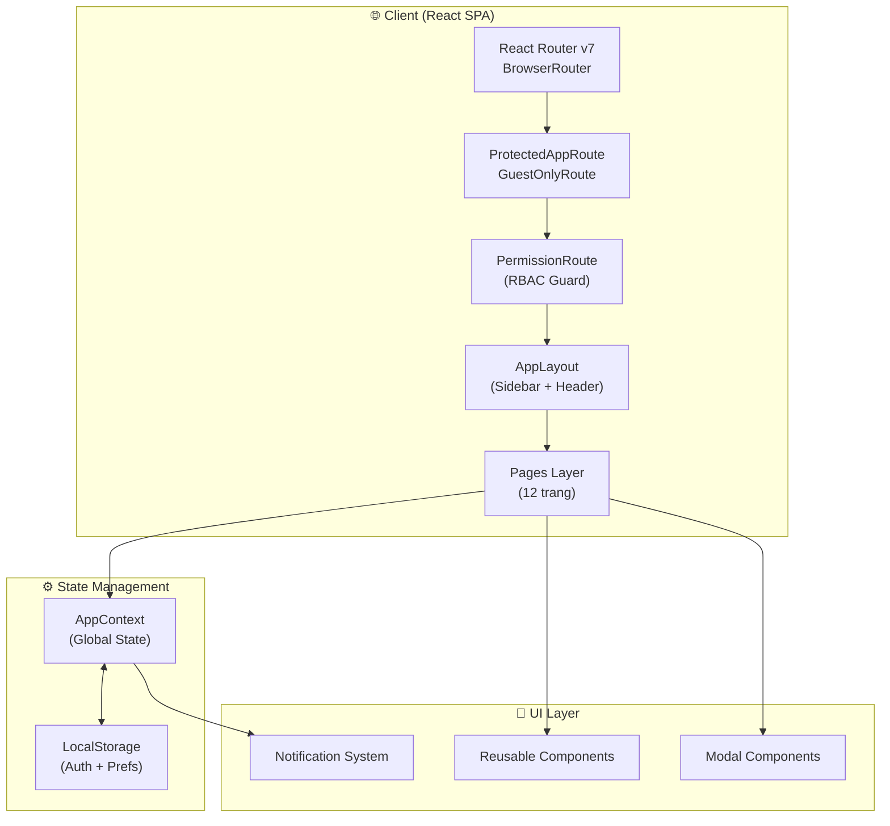
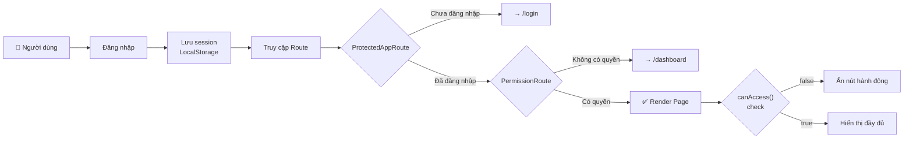
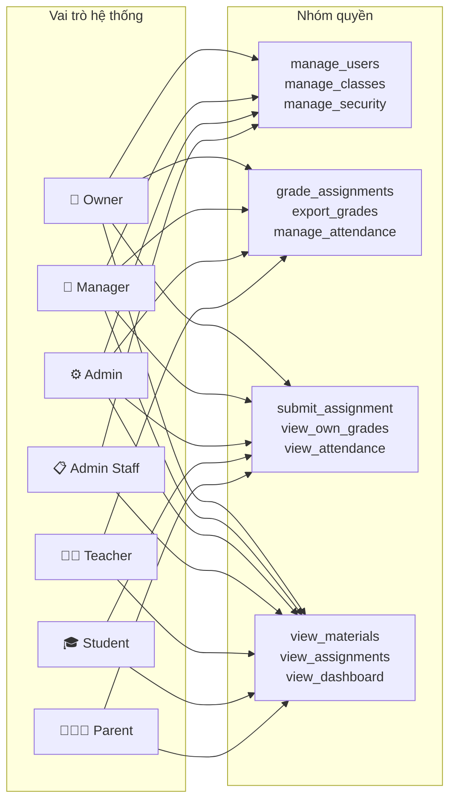
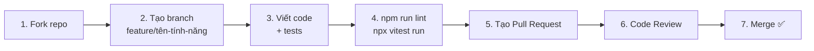

<div align="center">

# 🎓 SMASH Math — Hệ thống Quản lý Trung tâm Toán học

**Nền tảng quản lý giáo dục toàn diện dành cho trung tâm dạy học**

[](https://react.dev)
[](https://www.typescriptlang.org)
[](https://vitejs.dev)
[](https://tailwindcss.com)
[](LICENSE)

[Demo](#) · [Báo lỗi](issues) · [Đề xuất tính năng](issues)

</div>

---

## 📖 Giới thiệu

**SMASH Math** là hệ thống quản lý trung tâm giáo dục được xây dựng trên nền tảng web hiện đại. Hệ thống hỗ trợ đầy đủ vòng đời vận hành của một trung tâm dạy học — từ quản lý lớp học, phân công giáo viên, chấm điểm, điểm danh, đến làm bài kiểm tra trực tuyến và xuất báo cáo.

Điểm nổi bật của hệ thống là kiến trúc **RBAC (Role-Based Access Control)** chặt chẽ, đảm bảo mỗi vai trò chỉ truy cập đúng chức năng được phép — từ cấp route đến từng nút bấm trên giao diện.

---

## ✨ Tính năng nổi bật

| Nhóm | Tính năng |
|------|-----------|
| 🔐 **Xác thực & Phân quyền** | Đăng nhập, đăng ký, quên mật khẩu, RBAC 7 vai trò, PermissionRoute |
| 👥 **Quản lý người dùng** | Thêm/sửa/xóa tài khoản, duyệt yêu cầu đăng ký, khóa tài khoản |
| 🏫 **Quản lý lớp học** | Tạo lớp, phân công giáo viên, quản lý lịch học, báo cáo lớp |
| 📚 **Bài tập & Tài liệu** | Tạo bài tập, đính kèm file, phân loại theo lớp và loại bài |
| 📝 **Làm bài trực tuyến** | Trắc nghiệm có đếm giờ, tự luận, tự động tính điểm, lưu kết quả |
| 📊 **Chấm điểm & Báo cáo** | Nhập điểm nhiều loại, xếp loại học lực, xuất PDF/in bảng điểm |
| 📅 **Điểm danh** | Ghi nhận điểm danh theo buổi, xem lịch sử, lọc theo học viên |
| 📢 **Thông báo** | Tạo thông báo theo nhóm đối tượng, ghim, phân mức độ ưu tiên |
| 🎭 **Demo Mode** | Chuyển đổi vai trò nhanh không cần đăng xuất (DemoRoleSwitcher) |

---

## 🏗️ Kiến trúc tổng thể

### Sơ đồ kiến trúc ứng dụng



### Luồng phân quyền RBAC



### Bảng phân quyền theo vai trò



---

## 🛠️ Công nghệ sử dụng

| Công nghệ | Phiên bản | Mục đích |
|-----------|-----------|----------|
| [React](https://react.dev) | 19 | UI framework |
| [TypeScript](https://www.typescriptlang.org) | 5.8 | Type safety |
| [Vite](https://vitejs.dev) | 6 | Build tool & dev server |
| [Tailwind CSS](https://tailwindcss.com) | 4 | Utility-first styling |
| [React Router](https://reactrouter.com) | 7 | Client-side routing |
| [Motion](https://motion.dev) | 12 | Animations |
| [Lucide React](https://lucide.dev) | 0.546 | Icon library |
| [Vitest](https://vitest.dev) | 4 | Unit & property-based testing |
| [fast-check](https://fast-check.io) | 4 | Property-based testing |
| [Google Gemini AI](https://ai.google.dev) | 1.29 | AI integration |

---

## 📦 Cài đặt

### Yêu cầu hệ thống

- **Node.js** ≥ 18.0.0
- **npm** ≥ 9.0.0 (hoặc pnpm / yarn)

### Các bước cài đặt

**1. Clone repository**

```bash
git clone https://github.com/your-org/smash-math.git
cd smash-math
```

**2. Cài đặt dependencies**

```bash
npm install
```

**3. Cấu hình biến môi trường**

```bash
cp .env.example .env
```

Chỉnh sửa file `.env` theo hướng dẫn ở [phần cấu hình](#-cấu-hình-môi-trường) bên dưới.

---

## 🚀 Chạy dự án

### Môi trường phát triển

```bash
npm run dev
```

Ứng dụng sẽ chạy tại `http://localhost:3000`

### Build production

```bash
npm run build
```

Output sẽ được tạo trong thư mục `dist/`.

### Preview bản build

```bash
npm run preview
```

### Kiểm tra TypeScript

```bash
npm run lint
```

### Chạy tests

```bash
# Chạy toàn bộ test suite
npx vitest run

# Chạy test cụ thể
npx vitest run src/components/auth/PermissionRoute.pbt.test.tsx

# Chạy ở chế độ watch
npx vitest
```

---

## ⚙️ Cấu hình môi trường

Tạo file `.env` từ `.env.example` và điền các giá trị sau:

```env
# Bắt buộc: API key cho Google Gemini AI
GEMINI_API_KEY="your-gemini-api-key-here"

# URL triển khai ứng dụng (dùng cho OAuth callback, self-referential links)
APP_URL="http://localhost:3000"

# Bật DemoRoleSwitcher widget để chuyển đổi vai trò nhanh
# Chỉ dùng trong môi trường development/demo, KHÔNG bật ở production
VITE_DEMO_MODE="true"
```

> **Lưu ý bảo mật:** Không commit file `.env` lên repository. File này đã được thêm vào `.gitignore`.

### Tài khoản demo

Khi `VITE_DEMO_MODE=true`, bạn có thể dùng DemoRoleSwitcher (góc dưới phải) hoặc đăng nhập trực tiếp:

| Vai trò | Email | Mật khẩu |
|---------|-------|----------|
| Admin | `admin@smashmath.edu.vn` | `Smash@123` |
| Giáo viên | `teacher@smashmath.edu.vn` | `Smash@123` |
| Học viên | `student@smashmath.edu.vn` | `Smash@123` |
| Phụ huynh | `parent@smashmath.edu.vn` | `Smash@123` |

---

## 📁 Cấu trúc thư mục

```
smash-math/
├── public/                     # Static assets
├── src/
│   ├── components/
│   │   ├── auth/
│   │   │   └── PermissionRoute.tsx        # RBAC route guard component
│   │   ├── dashboard/
│   │   │   ├── AdminDashboard.tsx
│   │   │   ├── TeacherDashboard.tsx
│   │   │   ├── StudentParentDashboard.tsx
│   │   │   └── dashboardUtils.ts
│   │   ├── demo/
│   │   │   └── DemoRoleSwitcher.tsx       # Widget chuyển đổi vai trò demo
│   │   ├── grading/
│   │   │   ├── EssayGradingTab.tsx
│   │   │   ├── GradeTableTab.tsx
│   │   │   ├── CommentTab.tsx
│   │   │   └── PrintableGradeReport.tsx   # Component in bảng điểm
│   │   ├── layout/
│   │   │   ├── AppLayout.tsx              # Layout chính (sidebar + outlet)
│   │   │   ├── Sidebar.tsx                # Sidebar với RBAC menu filtering
│   │   │   └── ...
│   │   ├── modals/
│   │   │   ├── CreateClassModal.tsx
│   │   │   ├── CreateUserModal.tsx
│   │   │   ├── ApproveUsersModal.tsx
│   │   │   ├── AttendanceModal.tsx
│   │   │   └── ManageScheduleModal.tsx
│   │   └── schedule/
│   │       └── ScheduleMonthCalendar.tsx
│   ├── context/
│   │   └── AppContext.tsx                 # Global state, RBAC logic, demo data
│   ├── notifications/
│   │   ├── buildNotifications.ts          # Notification builder
│   │   └── types.ts
│   ├── pages/
│   │   ├── LoginPage.tsx
│   │   ├── RegisterPage.tsx
│   │   ├── ForgotPasswordPage.tsx
│   │   ├── DashboardPage.tsx
│   │   ├── ClassManagementPage.tsx        # 🔒 manage_classes
│   │   ├── ClassSchedulePage.tsx          # 🔒 manage_classes
│   │   ├── ClassReportPage.tsx            # 🔒 grade_assignments
│   │   ├── UserManagementPage.tsx         # 🔒 manage_users
│   │   ├── MaterialsPage.tsx              # 🔒 view_materials
│   │   ├── AssignmentsPage.tsx            # 🔒 view_assignments
│   │   ├── GradingPage.tsx                # 🔒 grade_assignments
│   │   ├── AttendancePage.tsx             # 🔒 view_attendance
│   │   ├── OnlineQuizPage.tsx             # 🔒 submit_assignment
│   │   ├── AnnouncementsPage.tsx
│   │   └── SettingsPage.tsx
│   ├── utils/
│   │   ├── gradeUtils.ts                  # classifyGrade, calcAverage
│   │   └── scheduleCalendar.ts
│   ├── App.tsx                            # Route definitions
│   ├── main.tsx
│   └── index.css                          # Global styles + @media print
├── .kiro/
│   └── specs/
│       └── missing-features-rbac/         # Spec-driven development docs
│           ├── requirements.md
│           ├── design.md
│           └── tasks.md
├── .env.example
├── vite.config.ts
├── tsconfig.json
└── package.json
```

> 🔒 Các trang có ký hiệu này yêu cầu permission tương ứng, được bảo vệ bởi `PermissionRoute`.

---

## 🧪 Kiểm thử

Dự án sử dụng **Vitest** kết hợp **fast-check** cho property-based testing (PBT).

### Cấu trúc test

```
src/
├── components/
│   ├── auth/
│   │   └── PermissionRoute.pbt.test.tsx   # PBT: RBAC dispatcher
│   └── grading/
│       ├── EssayGradingTab.pbt.test.ts    # PBT: Essay grading
│       └── GradeTableTab.pbt.test.ts      # PBT: Grade table
├── context/
│   ├── AppContext.grading.test.ts         # Unit: Grading logic
│   └── AppContext.grading.pbt.test.ts     # PBT: Grading properties
└── pages/
    └── GradingPage.pbt.test.ts            # PBT: Grading page
```

### Ví dụ property test

```typescript
// Kiểm tra: submit_assignment chỉ dành cho student
it('Property 1.1: submit_assignment chỉ dành cho student', () => {
  fc.assert(
    fc.property(fc.constantFrom(...allRoles), (role: RoleKey) => {
      const hasPermission = canAccessPermission(role, 'submit_assignment');
      if (role === 'student') {
        expect(hasPermission).toBe(true);
      } else {
        expect(hasPermission).toBe(false);
      }
    })
  );
});
```

---

## 🤝 Hướng dẫn đóng góp

Chúng tôi hoan nghênh mọi đóng góp! Vui lòng đọc kỹ hướng dẫn trước khi bắt đầu.

### Quy trình đóng góp



### Quy ước đặt tên branch

```
feature/tên-tính-năng     # Tính năng mới
fix/mô-tả-lỗi             # Sửa lỗi
docs/cập-nhật-tài-liệu    # Cập nhật tài liệu
refactor/tên-module        # Tái cấu trúc code
```

### Quy ước commit message

Tuân theo [Conventional Commits](https://www.conventionalcommits.org/):

```
feat: thêm tính năng làm bài trực tuyến
fix: sửa lỗi hiển thị modal tạo bài tập
docs: cập nhật README với hướng dẫn cài đặt
refactor: tách logic phân quyền ra PermissionRoute
test: thêm property test cho classifyGrade
```

### Tiêu chuẩn code

- **TypeScript strict mode** — không dùng `any` nếu không cần thiết
- **Component** — functional components với hooks
- **Styling** — Tailwind CSS utility classes, không viết CSS inline
- **Tests** — viết unit test và property test cho logic quan trọng
- **RBAC** — mọi tính năng mới phải kiểm tra permission phù hợp

### Báo cáo lỗi

Khi tạo issue, vui lòng cung cấp:
1. Mô tả lỗi rõ ràng
2. Các bước tái hiện lỗi
3. Kết quả mong đợi vs thực tế
4. Screenshots (nếu có)
5. Môi trường (OS, browser, Node version)

---

## 🗺️ Lộ trình phát triển

### ✅ Đã hoàn thành (v1.0)

- [x] Hệ thống xác thực (đăng nhập, đăng ký, quên mật khẩu)
- [x] RBAC toàn hệ thống với 7 vai trò
- [x] Quản lý lớp học, lịch học, báo cáo lớp
- [x] Quản lý bài tập với đính kèm file
- [x] Làm bài trực tuyến (trắc nghiệm + tự luận)
- [x] Hệ thống chấm điểm và xếp loại học lực
- [x] Điểm danh theo buổi học
- [x] Xuất PDF / In bảng điểm
- [x] Thông báo theo nhóm đối tượng
- [x] DemoRoleSwitcher cho môi trường demo
- [x] Property-based testing cho logic cốt lõi

### 🔄 Đang phát triển (v1.1)

- [ ] Tích hợp backend API thực (thay thế demo data)
- [ ] Xác thực JWT với refresh token
- [ ] Upload file thực lên cloud storage
- [ ] Thông báo real-time (WebSocket)

### 📋 Kế hoạch (v2.0)

- [ ] Ứng dụng mobile (React Native)
- [ ] Tích hợp thanh toán học phí
- [ ] Báo cáo phân tích nâng cao với biểu đồ
- [ ] AI hỗ trợ chấm bài tự luận (Gemini)
- [ ] Hệ thống nhắn tin nội bộ
- [ ] Đa ngôn ngữ (i18n)
- [ ] Dark mode

---

## 📄 Giấy phép

Dự án này được phân phối dưới giấy phép **MIT License**.

```
MIT License

Copyright (c) 2025 SMASH Math

Permission is hereby granted, free of charge, to any person obtaining a copy
of this software and associated documentation files (the "Software"), to deal
in the Software without restriction, including without limitation the rights
to use, copy, modify, merge, publish, distribute, sublicense, and/or sell
copies of the Software...
```

Xem file [LICENSE](LICENSE) để biết thêm chi tiết.

---

<div align="center">

Được xây dựng với ❤️ bởi đội ngũ **SMASH Math**

[⬆ Về đầu trang](#-smash-math--hệ-thống-quản-lý-trung-tâm-toán-học)

</div>
